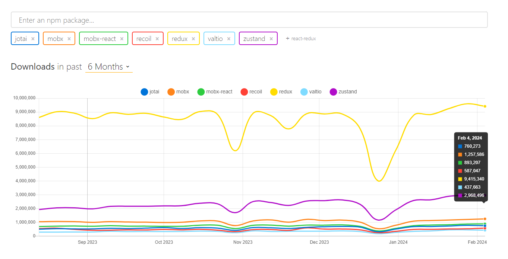

# React における状態管理ライブラリについて

## 状態管理とは

React における状態管理とは

## なぜ状態管理ライブラリが必要なのか

## 調査するライブラリ

1. 状態管理ライブラリを使わない場合 (Context API)
2. Redux
3. Zustand
4. Mobx
5. Recoil
6. Jotai
7. Valtio

2024-02-15 時点の npm の DL 数はこのような感じになっています。

Redux が圧倒的に多く使用されており、ついで Zustand, MobX, etc...となっています。  
最も人気な Redux を使えばとりあえず良さそうな気もしますが、なぜ Redux が人気なのかや、ここでの開発に最も適した状態管理ライブラリは何なのか等も含めて調査したいため、マイナーな状態管理ライブラリも調査対象に含めています。

これらのライブラリを実際に使用して、私が感じた点をまとめていきたいと思います。  
state-app ディレクトリ内でこれらのライブラリを試用しようと思っていますので、そちらも合わせて参照ください。  
結果だけを見たい方は一番最後のまとめを参照ください。

## 状態管理ライブラリを使わない場合 (Context API)

## Redux

## Zustand

## Mobx

## Recoil

## Jotai

## Valtio

## まとめ
