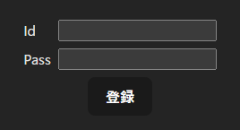
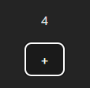

# 近年のモダンフロントエンド開発環境について

この資料では、近年のモダンフロントエンド開発環境において重要な役割を担っている、TypeScript, React, Next.js についてそれぞれ解説し、  
これらの技術が Node.js とどのように関わりあっているかについても詳しく解説していきます。

また、これらの技術を開発環境に導入した際に、どのような効果が得られるのかについても触れていきます。

基本的にある技術についての解説を行う際は、以下の順番で解説を行います。  
また、用語の解説等は随時入ります。  
こちらを念頭に入れて見ていただけると分かりやすいかと思います。

1. その技術についてざっくりした紹介
2. 機能や特徴
3. Node.js との関係性
4. メリット
5. デメリット
6. まとめ

## はじめに

まずはじめにこれらの技術の基盤となる Node.js について解説します。

## Node.js について

Node.js はサーバーサイドで JavaScript を実行するための実行環境です。  
Google Chrome 等のブラウザには Google が開発した V8 という JavaScript エンジンが標準搭載されており、これによりブラウザ上で JavaScript が実行可能となっています。  
この V8 をベースにサーバーサイドで実行できるように拡張を行ったのが Node.js です。

### Node.js が開発された目的

従来の Web 開発において、フロントエンドでは JavaScript を、サーバーサイドでは C#、Python、Java などの他のプログラミング言語を使用することが一般的でした。  
しかし、フロントエンドとサーバーサイドで言語が分かれる事により、それぞれで学習コストが発生します。  
これを解決するために Node.js が開発されました。

### フロントエンド開発環境における Node.js の役割

Node.js はその開発目的からも分かる通り、JavaScript をサーバーサイドで実行出来るようにするための技術で、フロントエンドとは関わりの無い技術に思われるかも知れません。

しかし、実際には Node.js は現代のフロントエンド開発において無くてはならない重要な技術となっています。  
その理由は、Node.js が提供する強力なパッケージマネージャー (npm) と、コードの再利用を容易にするモジュールシステムにより、多くのフロントエンド開発ツールが利用可能になっているためです。

開発者は npm を通して、フロントエンド開発を効率化し、より手軽にするための多様なツールを簡単にプロジェクトに組み込むことができます。  
その結果、Node.js を中心に、フロントエンド開発を支援する豊富なツールやライブラリのエコシステムが築かれていきました。  
これから説明する TypeScript, React, Next.js もそのうちの 1 つです。

## TypeScript について

TypeScript は、JavaScript を拡張し、型などの追加の機能を持たせたオープンソースの静的型付け言語です。  
Microsoft 社により開発・保守が行われています。

TypeScript は JavaScript の完全なスーパーセットであり、JavaScript の構文を全てサポートしています。  
そのため、JavaScript で書かれたコードは TypeScript でも同様に実行可能です。  
これにより、TypeScript を途中からプロジェクトに導入した場合でも、既存の JavaScript のコードに影響を与えること無く型安全に開発を行うことができます。

### TypeScript の機能

TypeScript の主な機能は、変数や関数への型の注釈と、型の推論の 2 つです。

型の注釈から解説を行います。  
例として、以下のような引数同士を足して結果を返すだけの単純な関数の場合を考えます。  
JavaScript の場合は以下のようになります。

```js
// JavaScript の場合
function addNumbers(a, b) {
  return a + b;
}
```

呼び出しは以下のようになります。  
JavaScript の場合は数値を渡すところを誤って文字列を渡してしまった場合もエラーにはなりません。

```js
// JavaScript の場合
console.log(addNumbers(5, 10)); // 15
console.log(addNumbers(5, "10")); // "510"
```

上記の例ように単純に計算を行うだけであれば結果がおかしいという事ですぐ気付けると思いますが、  
以下のように数値によって区分を行う等の処理が挟まっていた場合、更に不具合に気づきづらくなります。

```js
// JavaScript の場合
const result = addNumbers(5, "10"); // "510"
let section;
if (result > 500) {
  section = "A";
} else {
  section = "B";
}

console.log(section); // "A"
```

TypeScript を導入することでこれらの不具合を未然に防ぐことが出来ます。  
同様の例を考えます。TypeScript では他の静的型付け言語と同様に各引数と返り値に型を指定することが出来ます。

```ts
// TypeScript の場合
function addNumbers(a: number, b: number): number {
  return a + b;
}
```

呼び出しは以下のようになります。  
コンパイルエラーにより実行前に不具合に気づく事ができます。

```ts
// TypeScript の場合
console.log(addNumbers(5, 10)); // 15
console.log(addNumbers(5, "10")); // コンパイルエラー (引数はnumber型と指定されているため)
```

これはほんの一例に過ぎませんが、TypeScript を導入することにより JavaScript の動的型付けが故の様々な不具合を未然に防ぐことが出来ます。

次に型の推論について解説します。  
TypeScript は型を指定しない場合、自動で型推論を行います。  
これにより、導入するだけでも一定の効果が得られます。  
例えば JavaScript ではエラーにならない以下の様なケースを防ぐことが出来ます。

```ts
let a = 100; // number 型と推論される
a = "200"; // コンパイルエラー (number型にstring型を代入しようとしているため)
```

### TypeScript と Node.js の関係性

現状、TypeScript はブラウザで直接実行することができません。  
この理由は、Google Chrome 等のブラウザに搭載されている V8 JavaScript エンジンが TypeScript の構文を直接解釈できないためです。  
また、TypeScript はあくまでも JavaScript にトランスパイルされることを前提として開発された言語であり、ブラウザで実行される前に JavaScript に変換しておく必要があります。

そのためのコンパイラを Node.js の npm を通じてインストールして使用することが出来ます。  
→ TypeScript コンパイラ (tsc)

### TypeScript を導入した場合のメリット

TypeScript を導入した場合に得られるメリットは主に以下の 3 つです。

1. 型の機能により、変数への想定外の代入等を未然に防ぎ、バグのリスクを低減することができます。
   これにより、アプリケーション全体の品質向上とコードの品質向上に繋がります。

2. 静的型付け言語であるため、IDE によるコード補完等が強化され、開発効率が向上します。

3. JavaScript と何らかの静的型付け言語 (C#, Java 等) の知識があれば、学習コストはかなり少なくなります。

### TypeScript を導入した場合のデメリット

1. JavaScript に型情報を追記するため、記述量が少し増える。

### TypeScript についてのまとめ

TypeScript は現代のモダンフロントエンド開発において、デファクトスタンダードになりつつあります。  
これは、TypeScript が提供する型安全性によってアプリケーション全体の品質が向上し、開発効率が高まるなどの大きなメリットがあるためです。  
また、JavaScript と 他に静的型付け言語の知識があれば、学習コストがそれほど高く無いのも利点の 1 つです。

## React について

React は UI を構築するためのオープンソースの JavaScript ライブラリです。  
Meta (旧 Facebook) によって開発・保守が行われています。

React はコンポーネントベースのライブラリであり、  
個々のコンポーネントの中で、JSX という独自の記法を用いて UI を定義します。  
また宣言的に UI を定義できるという特徴を持っており、そのための関数群が提供されています。  
それぞれの特徴について順番に解説していきます。

### JSX とは

JSX とは同じく Meta (旧 Facebook) によって開発された JavaScript の拡張構文です。  
主に React で使用する目的で開発された構文ですが、Vue.js や他のライブラリ・フレームワークでも利用可能です。

JSX により、.js ファイルの中に HTML のような構文の書き方をすることが可能になります。  
これにより、.js ファイルと .html ファイル を 1 つのファイルにまとめることができます。

以下のようなコンポーネントを実装する場合を考えます。


プレーンな JavaScript 等であれば UI を定義するための .html ファイルと処理を実装するための .js ファイルの 2 ファイルを作成する必要がありますが、  
React では以下のように 1 つのファイルにまとめることができます。

```jsx
export function Form {
  // JavaScript による処理の実装
  const [name, setName] = useState("");
  const onChange = (e) => {
    setName(e.target.value);
  };
  const onSubmit = () => {
    console.log("送信ボタンが押されました")
  };

  // JSX による UI の実装
  return (
    <div>
      <div>
        <span>名前</span>
        <input type="text" value={name} onChange={onChange} />
      </div>
      <button onClick={onSubmit}>送信</button>
    </div>
  )
}
```

上記のように、1 つの .js ファイルに UI と処理をまとめることができます。  
UI と処理をまとめることで、一貫性のある保守のしやすいコンポーネントが定義できます。

> ※ JSX を含んだコードは実行前にトランスパイルすることが必須になります。これは、V8 Javascript エンジン等が JSX を直接解釈することができないためです。

### コンポーネントベース

コンポーネントベースとは、あるページを構成する要素を独立した再利用可能な部品（コンポーネント）に分割し、それぞれが独自の構造、UI、データ、振る舞いを持つという設計思想です。

例えば、ユーザー登録画面とログイン画面を作成する場合、以下のようなコンポーネントを作成します。

> コンポーネントの名前: UserInfoInputForm  
> 引数:
>
> > buttonLabel: ボタンのラベル  
> > buttonOnClick: ボタン押下時の処理
>
> 

このようなコンポーネントを作成しておくことで、各画面で共通でこのコンポーネントを使用して画面の実装が行なえます。  
以下、各画面の実装例です。

ユーザー登録画面

> ```jsx
> export function RegisterPage() {
>
>   // 登録ボタン押下時の処理
>   function register (id, pass) { /* 処理 */ }
>
>   // UI
>   return <UserInfoInputForm buttonLabel={"登録"} buttonOnClick={register}>
> }
> ```
>
> 実際の表示  
> 

ログイン画面

> ```jsx
> export function LoginPage() {
>
>   // ログインボタン押下時の関数
>   function login (id, pass) { /* 処理 */ }
>
>   // UI
>   return <UserInfoInputForm buttonLabel={"ログイン"} buttonOnClick={login}>
> }
> ```
>
> 実際の表示  
> 

このように共通のコンポーネントを使用することで、開発効率の向上、コード量の削減、UI/UX の統一化、保守性の向上等さまざまな恩恵があります。  
これが React の根底にあるコンポーネントベースの思想になります。

### 宣言的な UI

宣言的 UI とは、開発者が UI のみを宣言し、その具体的な描画方法はフレームワークやライブラリに委ねるという概念です。  
knockout.js も宣言的 UI のライブラリです。  
ここではわかりやすさ重視のため、knockout.js を使用した例を出します。

knockout.js では observable を使用して定義された変数がバインドされた DOM は、変数の値が更新された場合も自動的に DOM が更新されます。  
以下のようなボタンを押すたびにカウントアップするコンポーネントの場合を考えます。



knockout.js の場合

> index.html
>
> ```html
> <html>
>   <body>
>     <p data-bind="text: count"></p>
>     <button type="button" data-bind="click: countUp">+</button>
>   </body>
>   <script src="viewModel.js"></script>
>   <script src="index.js"></script>
> </html>
> ```
>
> viewModel.js
>
> ```js
> class ViewModel {
>   count = ko.observable(0);
>
>   countUp() {
>     const self = this;
>     self.count += 1;
>   }
> }
> ```
>
> index.js
>
> ```js
> window.onload = function () {
>   const viewModel = new ViewModel();
>   ko.applyBindings(viewModel);
> };
> ```

index.html で p タグに observable 項目の count がバインドされています。  
これにより、count の更新が検知されて、自動で DOM の描画と更新が行われます。  
そのため、開発者は count が更新された場合の DOM の描画や更新を意識する必要がありません。  
これが宣言的 UI の特徴である 「開発者は UI のみを定義し、描画方法はライブラリに委ねる」 の部分になります。

逆にもし count が observable 項目でなかった場合、開発者は対象の DOM を getElementByID 等で取得して innerText 等を自分で更新する必要があります。  
このように、自分で明示的に UI の更新を行う概念を 「命令的 UI」 と呼びます。  
プレーンな JavaScript 等がこれに該当します。

少し脱線しますが、同様の処理を React で実装すると以下のようになります。  
viewModel の定義や、お約束の applyBindings 等の処理が不要になります。  
また、React は .js ファイル 内に HTML (のような構文) を書けるため、ファイル数とコード量の削減に繋がります。

> Counter.tsx
>
> ```tsx
> // コンポーネントの定義
> export function Counter() {
>   const [count, setCount] = useState(0);
>   const onClick = () => setCount(count + 1);
>
>   // UI
>   return (
>     <div>
>       <p>{count}</p>
>       <button onClick={onClick}>+</button>
>     </div>
>   );
> }
> ```

### React と Node.js の関係性

React で書かれたコードはトランスパイルが必須です。  
その理由は、V8 Javascript エンジン等が JSX を直接解釈することができないためと、React の開発に ES6 (※1) やそれ以降のバージョン (まとめて ES6+ と呼びます) の JavaScript の機能が幅広く使用されているためです。  
全てのブラウザが ES6+ の機能を全てサポートしている訳では無いので、ES6+ で書かれたコードを ES6 互換のコードにトランスパイルする必要があります。

そのトランスパイルを行うツールとして Babel 等の JavaScript コンパイラーが存在し、これらを npm を介してインストール、使用することができます。

> ※1: ES6 (ES2015) とは JavaScript の標準化を行う団体である Ecma International のもとで標準化された JavaScript の規格のことです。  
> 2015 年に公開された第 6 版の規格を ES6 または ES2015 と呼称します。  
> この規格で近年の JavaScript 開発で欠かせない様々な機能 (let/const, アロー関数, モジュール 等々...) が仕様として追加されました。

### React を導入した場合のメリット

React を導入した場合のメリットは主に以下の 6 つです。

1. 共通のコンポーネントを開発していくことで、全体の記述量を大幅に減らせるため、開発効率の向上に繋がります。

2. 共通のコンポーネントを利用することで、その修正箇所をコンポーネントの実装部の一箇所に絞ることができるため、保守性の向上に繋がります。

3. 共通のコンポーネントを利用するため、全体的に UI/UX の統一化が行なえます。

4. コンポーネント単位で作業の分担が行えるため、作業分担が容易になります。

5. 各コンポーネント同士が疎結合であるように実装を行うことで、ユニットテストの実装がしやすくなり、アプリケーションの信頼性の向上に繋がります。

6. React では画面の更新を行う際に、内部で保持している変更前後の仮想 DOM から差分を算出し、必要最低限の分だけ実際の DOM の更新を行います。  
   従来の DOM や、フレームワークで構築された DOM に比べて処理のスピードが速く、Web ページの更新を高速化でき、パフォーマンスの向上に繋がります。

### React を導入した場合のデメリット

1. 学習コストが中程度ある。

2. HTML も CSS も全て JavaScript に書けるようになります。そのため JavaScript の比重が増えます。  
   これはデメリットというより特徴に近いかもしれません。

### React についてのまとめ

React は現在、世界で最も利用されているライブラリです。( The State of JS 2022 による統計で 82% )  
そのため、将来性・信頼性が高く、また文献も多く、採用が楽になる等の開発効率向上以外の多方面でメリットがあります。  
導入による開発効率向上効果もとても大きいため、TypeScript と合わせて導入するべき技術だと感じました。

## Next.js について

Next.js とは React をベースにしたオープンソースのフルスタック Web アプリケーションフレームワークです。  
Vercel によって開発・保守が行われています。

React はクライアントサイドで UI を構築するためのライブラリであるのに対して、Next.js はサーバーサイドも含めたフルスタックで包括的な開発を可能にするためのフレームワークです。  
また、ディレクトリ構造からルーティングを行う App Router を採用しており、これにより、直感的に SPA を構築することが可能になります。

次に SPA と MPA について解説します。

### SPA と MPA について

SPA (シングルページアプリケーション) とは Web サイトの設計構造の 1 種です。  
対称となる設計構造として MPA (マルチページアプリケーション) があります。

従来の Web サイトはサーバーサイドでルーティングを行い、クライアントからリクエストがあるとサーバーが対応した HTML をレスポンスし、  
クライアントはその HTML を表示するという構造になっています。これが MPA に該当します。  
MPA の場合、ページ遷移を行う度にサーバーサイドにアクセスしページの再読み込みを行う必要があるため、画面の更新に時間がかかります。  
また、フロントエンドとバックエンドが密結合になるという特徴も持っています。

これを解決するために登場したのが SPA です。  
SPA では、初回のページ読み込み時に HTML、JavaScript、CSS などの必要なリソースを一度にまとめてクライアントに送信します。  
ページの遷移時には、画面更新に必要な差分データのみをサーバーから取得して、クライアントサイドではページ全体ではなく差分がある箇所のみを更新します。  
これにより、ページの再読み込みを必要としない、UX に優れたアプリケーションを構築することができます。

ただ、SPA と MPA どちらにも長所と短所があります。  
これらについて軽くまとめます。

#### SPA の特徴

長所

1. ページ遷移が高速なため UX が向上する
2. フロントエンドとバックエンドを分離できる
3. 初回ロード後は、必要な差分データのみを取得するため通信量の削減につながる

短所

1. 初回ロードに時間がかかる
2. SEO に弱い
3. 画面のリロードを一切行わないため、メモリリーク (使用していないメモリを開放し忘れること) が起きやすくなる。
4. JavaScript への依存度が増える

#### MPA の特徴

1. 新たなフレームワークやライブラリを学習する必要がないため、開発がシンプル
2. SEO 対策が容易
3. 初回ロードは早い
4. JavaScript が無効化されている環境やブラウザ等でも実行可能

短所

1. ページ遷移に時間がかかり、再読み込みが必要なため UX が低下する
2. フロントエンドとバックエンドの密結合
3. ページ数が多くなるにつれ、管理が煩雑になり開発コストが増加する

#### SPA と MPA のまとめ

それぞれの特徴についてまとめましたが、どちらが正解ということはなく、ニーズや要件にあった設計構造を選択することが重要になります。

また、Next.js を採用する場合は必然的に SPA になります。  
MPA 的なアプローチを行うことも出来ますが、構造が複雑になり、管理が煩雑になる可能性があります。

### Next.js の主な機能

Next.js が提供する機能は数多ありますが、ここでは代表的なものを紹介させていただきます。

1. レンダリング  
   サーバーサイドレンダリング (SSR) や、静的サイト生成 (SSG) 等を実装することができます。  
   これらは、サーバーサイドでレンダリングした HTML をクライアントサイドに渡し、クライアントサイドは単にそれを描画するといった手法ですが、  
   これにより、クライアントサイドでの計算量を最小限にし、React の課題でもある初期表示の遅さを改善することができす。

2. ルーティング  
   App Router というファイルシステムに基づくルーティングシステムにより、app ディレクトリ内のディレクトリ構造がそのままルーティングされます。  
   これにより、直感的なルーティングを行うことが出来ます。

3. 最適化  
   Next.js では Web アプリのパフォーマンスを向上させるために数多くの最適化の仕組みがあります。  
   ここでは主要なもののみを紹介します。

   - レンダリング方法による最適化
   - 画像及び動画の最適化
   - スクリプト読み込みの最適化
   - 遅延読み込みによる初期表示の高速化

4. キャッシング  
   Next.js ではデフォルトで最大限のキャッシュを行います。  
   その中には、レンダリング作業やフェッチにより取得した結果のデータ等が含まれます。  
   これを適切に使用することで、データの取得回数が減り、パフォーマンスの向上に繋がります。

5. ビルドや各種サーバーの提供  
   Next.js ではビルドや、開発/本番サーバー等の各種サーバーの起動を行うための CLI が提供されています。  
   これにより Vite 等の開発ツール (ビルドや開発サーバーの起動を行うためのツール) を使用すること無く、各種サーバーの起動やアプリケーションのビルド等を行うことができます。

以上です。
これらは Next.js の機能の一部に過ぎず、この他にも DX と UX を向上させるための様々な機能を提供しています。

### Next.js と Node.js の関係性

Next.js は Web サーバーとしての役割も担っています。  
この Web サーバーは Node.js 上で動作し、next cli を通して起動等を行うことができます。  
そのため、Next.js で構築されたアプリケーションをデプロイして運用する場合、デプロイ先の環境にも Node.js を導入することが必須となります。

余談となりますが、Next.js では app ディレクトリ内で定義されたコンポーネントは基本的に RSC (※1) として扱われます。  
これにより SSR 等が可能になっているのですが、RSC も サーバーランタイムの Node.js 上でしか動作しません。

> ※1: RSC (React Server Components) とは React 18 で実験的に導入・公開された機能で、サーバーサイドでレンダリングを行う React コンポーネントを定義するための機能です。  
> React には元々、クライアントサイドで計算と表示を行う 「クライアントコンポーネント」 しかありませんでした。  
> しかし、クライアントサイドで計算も表示も全て行うと、クライアントサイドにおけるパフォーマンスの悪化が懸念されます。  
> そこで開発されたのが RSC です。  
> RSC を用いて、サーバーサイドで計算しレンダリングした結果をクライアントサイドに渡し、クライアントサイドでは描画のみを行うことで、クライアントサイドでの計算量を減らすことが出来ます。

### Next.js を導入した場合のメリット

1. App Router により、SPA の構築が簡単に行えるため、React をベースにしたプロジェクトにおいて手軽に UX を向上させることができる。

2. Next.js のレンダリングや最適化の機能により、アプリケーション全体のパフォーマンス向上につながる。

3. フレームワークの制約により、実装の統一化が行える。

4. 開発ツールの側面も持っているため、一貫性のある統合的な開発環境の構築が可能になる。

### Next.js を導入した場合のデメリット

1. 学習コストが高い。

2. デプロイ環境における Node.js の導入が必須になる。

3. メジャーバージョンアップ時に破壊的変更が行われることがある。  
   → Next.js 12 から 13 のアップデートにおける、デフォルトのルーティングシステムが Pages Router から App Router に変更された等  
   (詳しくは後述します)

#### Pages Router と App Router について

Next.js 13 で App Router が導入されましたが、それ以前は Pages Router がデフォルトのルーティングシステムでした。

Pages Router は App Router と同様にファイルシステム基づくルーティングシステムで、pages ディレクトリ内のファイル名がそのままルーティングされる仕組みです。  
App Router との違いは App Router は 内部に page.tsx を持つディレクトリのフォルダ名がルーティングされますが、Pages Router は pages 配下のファイル名でルーティングを行います。

以下具体例です。
例えば、/hoge/fuga にルーティングを行う場合は以下のようになります。

> Pages Router: src/pages/hoge/fuga.tsx  
> App Router: src/app/hoge/fuga/page.tsx

Pages Router では pages ディレクトリ配下の全てのファイルがルーティングされてしまいます。  
そのため、そのページに関係あるが、ルーティングに関係の無いファイルは pages ディレクトリに配置できないという問題がありました。  
App Router ではこの問題が解決されています。

また、App Router に変わった背景として RSC (React Server Components) の登場の影響があります。

従来の Next.js では getStaticProps と getServerSideProps という関数を用いて SSG と SSR を実現していました。  
しかし、RSC の登場でこれらの関数を使用しなくても SSG と SSR を実現できるようになったため、App Router ではデフォルトで RSC を使うように修正され、これらの関数は廃止されました。  
RSC に換装されたことにより、サーバーサイド処理の最適化がされパフォーマンスの向上にも繋がりました。

実際、この修正により DX、UX ともに向上しましたが、Pages Router から App Router に移行する作業と、廃止された getStaticProps 等の関数を削除する修正が求められました。

### Next.js のまとめ

Next.js は React をベースにした包括的な開発環境を構築するための様々な機能を提供します。  
これらの機能を利用することでパフォーマンスに優れたアプリケーションの開発を行う事ができるようになります。  
一方で、後方互換を無視した破壊的変更が行われることもままあるので、メリットとデメリットを天秤にかけた上で、  
慎重に採用を行うべき技術であると感じました。
